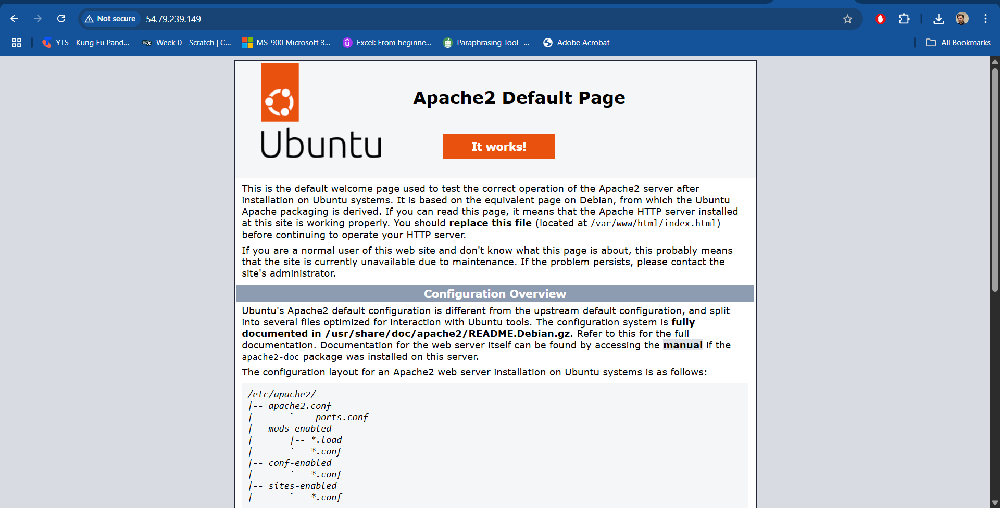
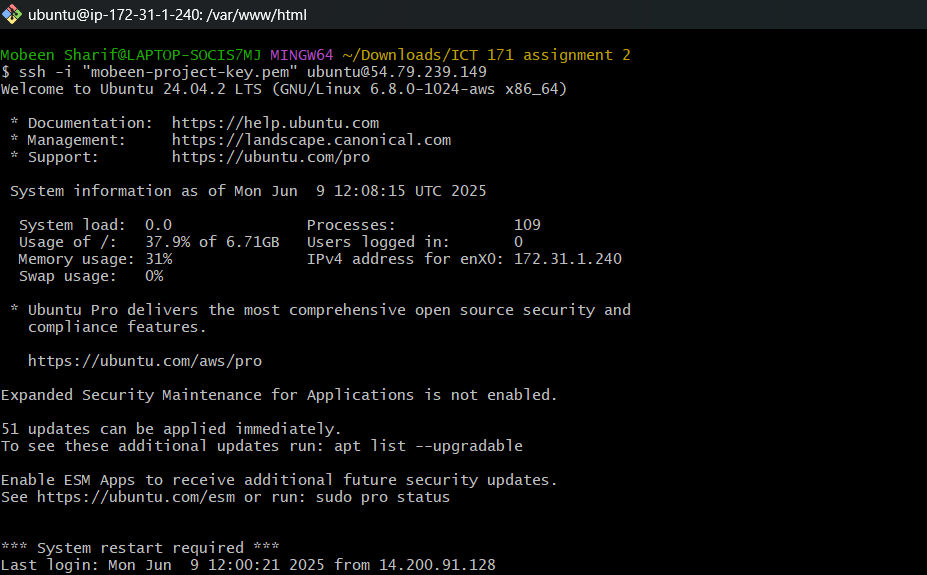
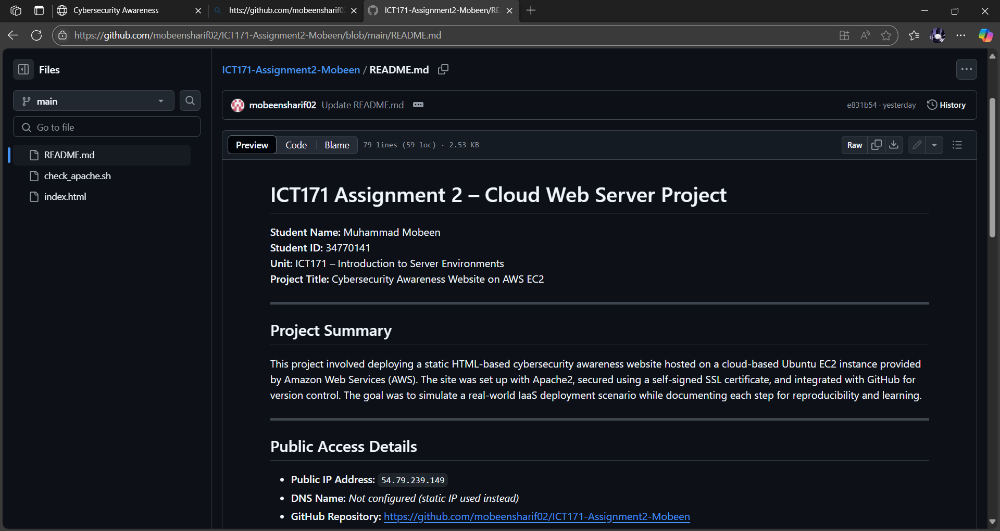
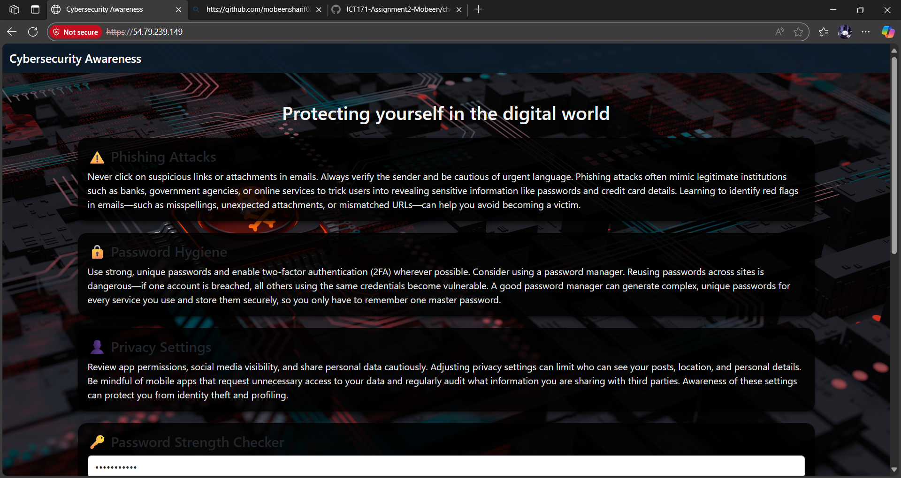
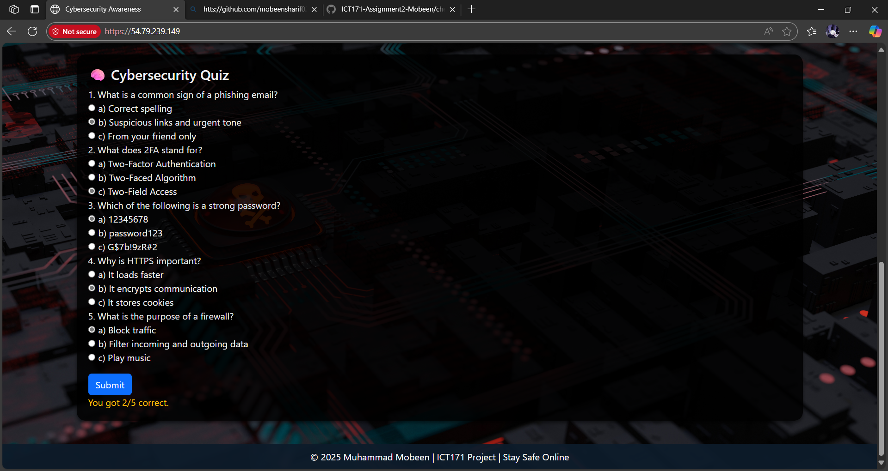
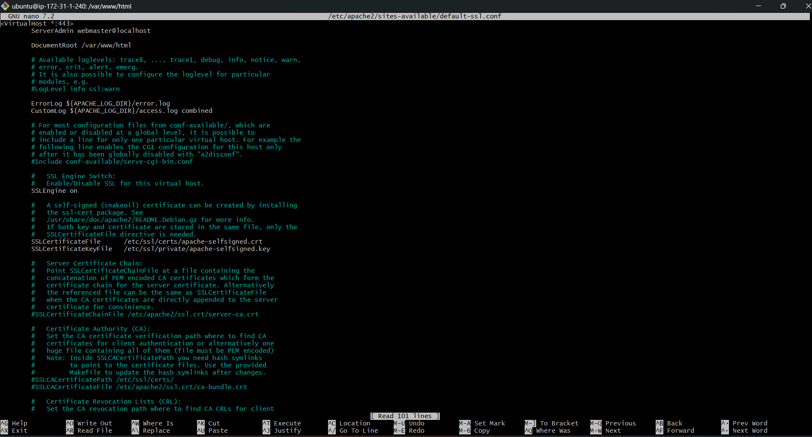
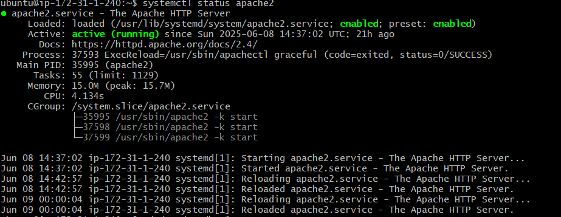
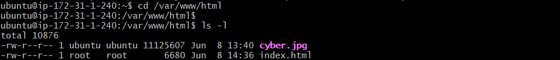

# ICT171 Assignment 2 – Cloud Web Server Project

**Student Name:** Muhammad Mobeen  
**Student ID:** 34770141  
**Unit:** ICT171 – Introduction to Server Environments  
**Project Title:** Cybersecurity Awareness Website on AWS EC2  

---

## Project Summary

This project involved deploying a static HTML-based cybersecurity awareness website hosted on a cloud-based Ubuntu EC2 instance provided by Amazon Web Services (AWS). The site was set up with Apache2, secured using a self-signed SSL certificate, and integrated with GitHub for version control. The goal was to simulate a real-world IaaS deployment scenario while documenting each step for reproducibility and learning.

---

## Public Access Details

- **Public IP Address:** `54.79.239.149`  
- **DNS Name:** *Not configured (static IP used instead)*
- **GitHub Repository:** [https://github.com/mobeensharif02/ICT171-Assignment2-Mobeen](https://github.com/mobeensharif02/ICT171-Assignment2-Mobeen)

---
## Steps to Reproduce the Server

### 1. Launch EC2 Instance on AWS
- Ubuntu 22.04 LTS
- t2.micro instance
- Allow ports 22 (SSH), 80 (HTTP), and 443 (HTTPS)
- Key Pair: `mobeen-project-key.pem`

### 2. SSH into Your EC2
```bash
ssh -i "mobeen-project-key.pem" ubuntu@54.79.239.149
sudo apt update
sudo apt install apache2 -y
sudo apt install openssl
```
### 3. Secure Apache with SSL (self-signed)
```
sudo openssl req -x509 -nodes -days 365 -newkey rsa:2048 \
-keyout /etc/ssl/private/apache-selfsigned.key \
-out /etc/ssl/certs/apache-selfsigned.crt
sudo a2enmod ssl
sudo a2ensite default-ssl.conf
sudo nano /etc/apache2/sites-available/default-ssl.conf
```
### 4. Update these two lines:
```
SSLCertificateFile      /etc/ssl/certs/apache-selfsigned.crt
SSLCertificateKeyFile   /etc/ssl/private/apache-selfsigned.key
```
### 5.Then Reload Apache
```
sudo systemctl reload apache2
```
### 6. Replace Web Content which you can find in "index.html" repository
```
sudo nano /var/www/html/index.html

```
After pasting the code press CTRL + O and press Enter to save.
Press CTRL + X to exit
## References & Acknowledgements

- Apache2 monitoring script inspired by community solution:  
  https://askubuntu.com/questions/611953/check-if-apache-is-running-else-start-apache

- HTML layout adapted from Bootstrap 5 Card example:  
  https://getbootstrap.com/docs/5.3/components/card/

- SSL certificate generation command from official OpenSSL documentation:  
  https://www.openssl.org/docs/manmaster/man1/openssl-req.html

- EC2 setup and hosting practices learned through ICT171 lectures, labs, and AWS documentation.
## 📸 Project Screenshots

### 1. Apache2 Default Webpage
This shows the default Apache2 page before uploading our own HTML content.


### 2. SSH Connection to EC2
Successfully connected using `.pem` key.


### 3. GitHub Repository with Files
Repository structure and version control view.


### 4. Hosted Website Home Page
This shows the live cybersecurity awareness site.


### 5. Password Checker & Quiz Interaction
Demonstrating quiz and password checker functionality.


### 6. Self-Signed SSL Access
Website running securely over HTTPS (with warning due to self-signed certificate).


### 7. Apache Running Status
Apache server status showing as `active (running)`.


### 8. Web Files Directory in EC2
Verifying that `index.html` and `cyber.jpg` are in `/var/www/html/`



